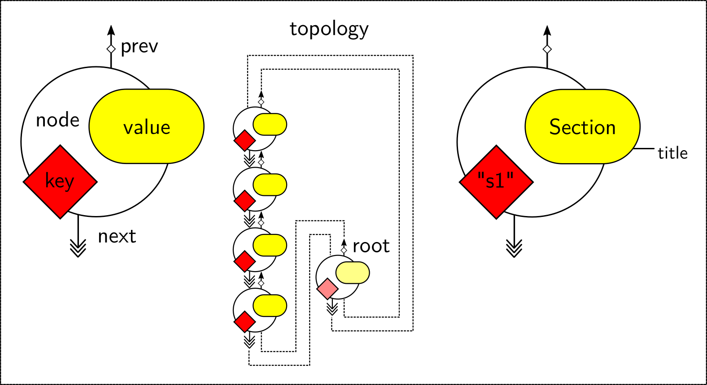

[](https://github.com/janjoswig/MDParser)
[](https://travis-ci.com/janjoswig/MDParser)

# MDParser

This is a package for Python-parsers to process typical file formats used for Molecular Dynamics simulations. Currently supported modules and highlights:

## Topologies (`mdparser.topology`)

### GROMACS (`GromacsTopParser`)

Read GROMACS topology (.top) files and image them as a Python object or vice versa. The structure of the file is essentially captured in a doubly-linked list exposing it for easy manipulation. Common tasks like adding parts to a topology, merging topologies, retrieval of information, or checking the file for consistency can be performed.

Here is an example topology file from the [GROMACS documentation](https://manual.gromacs.org/documentation/current/reference-manual/topologies/topology-file-formats.html):

```bash
;
;       Example topology file (topol.top)
;
; The force-field files to be included
#include "amber99.ff/forcefield.itp"

[ moleculetype ]
; name  nrexcl
Urea         3

[ atoms ]
   1  C  1  URE      C      1     0.880229  12.01000   ; amber C  type
   2  O  1  URE      O      2    -0.613359  16.00000   ; amber O  type
   3  N  1  URE     N1      3    -0.923545  14.01000   ; amber N  type
   4  H  1  URE    H11      4     0.395055   1.00800   ; amber H  type
   5  H  1  URE    H12      5     0.395055   1.00800   ; amber H  type
   6  N  1  URE     N2      6    -0.923545  14.01000   ; amber N  type
   7  H  1  URE    H21      7     0.395055   1.00800   ; amber H  type
   8  H  1  URE    H22      8     0.395055   1.00800   ; amber H  type

[ bonds ]
    1       2
    1       3
    1       6
    3       4
    3       5
    6       7
    6       8

[ dihedrals ]
;   ai    aj    ak    al funct  definition
     2     1     3     4   9
     2     1     3     5   9
     2     1     6     7   9
     2     1     6     8   9
     3     1     6     7   9
     3     1     6     8   9
     6     1     3     4   9
     6     1     3     5   9

[ dihedrals ]
     3     6     1     2   4
     1     4     3     5   4
     1     7     6     8   4

[ position_restraints ]
; ai   funct    fc
   1     1     1000    1000    1000 ; Restrain to a point
   2     1     1000       0    1000 ; Restrain to a line (Y-axis)
   3     1     1000       0       0 ; Restrain to a plane (Y-Z-plane)

[ dihedral_restraints ]
; ai   aj    ak    al  type  phi  dphi  fc
    3    6     1    2     1  180     0  10
    1    4     3    5     1  180     0  10

; Include TIP3P water topology
#include "amber99.ff/tip3p.itp"

[ system ]
Urea in Water

[ molecules ]
;molecule name   nr.
Urea             1
SOL              1000

```

The file can be read for example like this:

```python
from mdparser import topology as mdtop
from mdparser import tasks as mdtasks


parser = mdtop.GromacsTopParser(
    include_shared=True,                  # Resolve include directives
    include_blacklist=["forcefield.itp"]  # Leave some includes untouched
)

with open("topol.top") as topfile:
    top = parser.read(topfile)

```

By default, comments (starting with `";"`) are ignored and conditional directives (`#ifdef`/`#ifndef` blocks) are resolved. Each element of the topology file is represented as a node in the `top` object. More specifically, a topology-element is translated into a specific type of node-value:

```python
for node in top:
    print(f"{node.value!r}")

```
```python
Include("amber99.ff/forcefield.itp")
MoleculetypeSection()
MoleculetypeEntry(molecule='Urea', nrexcl=3)
AtomsSubsection()
AtomsEntry(nr=1, type='C', resnr=1, residue='URE', atom='C', cgnr=1, charge=0.880229, mass=12.01, typeB=None, chargeB=None, massB=None)
AtomsEntry(nr=2, type='O', resnr=1, residue='URE', atom='O', cgnr=2, charge=-0.613359, mass=16.0, typeB=None, chargeB=None, massB=None)
AtomsEntry(nr=3, type='N', resnr=1, residue='URE', atom='N1', cgnr=3, charge=-0.923545, mass=14.01, typeB=None, chargeB=None, massB=None)
AtomsEntry(nr=4, type='H', resnr=1, residue='URE', atom='H11', cgnr=4, charge=0.395055, mass=1.008, typeB=None, chargeB=None, massB=None)
AtomsEntry(nr=5, type='H', resnr=1, residue='URE', atom='H12', cgnr=5, charge=0.395055, mass=1.008, typeB=None, chargeB=None, massB=None)
AtomsEntry(nr=6, type='N', resnr=1, residue='URE', atom='N2', cgnr=6, charge=-0.923545, mass=14.01, typeB=None, chargeB=None, massB=None)
AtomsEntry(nr=7, type='H', resnr=1, residue='URE', atom='H21', cgnr=7, charge=0.395055, mass=1.008, typeB=None, chargeB=None, massB=None)
AtomsEntry(nr=8, type='H', resnr=1, residue='URE', atom='H22', cgnr=8, charge=0.395055, mass=1.008, typeB=None, chargeB=None, massB=None)
BondsSubsection()
BondsEntry(i=1, j=2, funct=None, c=[])
BondsEntry(i=1, j=3, funct=None, c=[])
BondsEntry(i=1, j=6, funct=None, c=[])
BondsEntry(i=3, j=4, funct=None, c=[])
BondsEntry(i=3, j=5, funct=None, c=[])
BondsEntry(i=6, j=7, funct=None, c=[])
BondsEntry(i=6, j=8, funct=None, c=[])
DihedralsSubsection()
DihedralsEntry(i=2, j=1, k=3, l=4, funct=9, c=[])
DihedralsEntry(i=2, j=1, k=3, l=5, funct=9, c=[])
DihedralsEntry(i=2, j=1, k=6, l=7, funct=9, c=[])
DihedralsEntry(i=2, j=1, k=6, l=8, funct=9, c=[])
DihedralsEntry(i=3, j=1, k=6, l=7, funct=9, c=[])
DihedralsEntry(i=3, j=1, k=6, l=8, funct=9, c=[])
DihedralsEntry(i=6, j=1, k=3, l=4, funct=9, c=[])
DihedralsEntry(i=6, j=1, k=3, l=5, funct=9, c=[])
DihedralsSubsection()
DihedralsEntry(i=3, j=6, k=1, l=2, funct=4, c=[])
DihedralsEntry(i=1, j=4, k=3, l=5, funct=4, c=[])
DihedralsEntry(i=1, j=7, k=6, l=8, funct=4, c=[])
PositionRestraintsSubsection()
PositionRestraintsEntry(i=1, funct=1, c=[1000.0, 1000.0, 1000.0])
PositionRestraintsEntry(i=2, funct=1, c=[1000.0, 0.0, 1000.0])
PositionRestraintsEntry(i=3, funct=1, c=[1000.0, 0.0, 0.0])
DihedralRestraintsSubsection()
DihedralRestraintsEntry(i=3, j=6, k=1, l=2, funct=1, c=[180.0, 0.0, 10.0])
DihedralRestraintsEntry(i=1, j=4, k=3, l=5, funct=1, c=[180.0, 0.0, 10.0])
MoleculetypeSection()
MoleculetypeEntry(molecule='SOL', nrexcl=2)
AtomsSubsection()
AtomsEntry(nr=1, type='OW', resnr=1, residue='SOL', atom='OW', cgnr=1, charge=-0.834, mass=16.0, typeB=None, chargeB=None, massB=None)
AtomsEntry(nr=2, type='HW', resnr=1, residue='SOL', atom='HW1', cgnr=1, charge=0.417, mass=1.008, typeB=None, chargeB=None, massB=None)
AtomsEntry(nr=3, type='HW', resnr=1, residue='SOL', atom='HW2', cgnr=1, charge=0.417, mass=1.008, typeB=None, chargeB=None, massB=None)
SettlesSubsection()
SettlesEntry(i=1, funct=1, c=[0.09572, 0.15139])
ExclusionsSubsection()
ExclusionsEntry(indices=[1, 2, 3])
ExclusionsEntry(indices=[2, 1, 3])
ExclusionsEntry(indices=[3, 1, 2])
SystemSection()
SystemEntry(name='Urea in Water')
MoleculesSection()
MoleculesEntry(molecule='Urea', number=1)
MoleculesEntry(molecule='SOL', number=1000)
```

The following figure illustrates, how these topology-elements are stored.



Nodes can be modified or deleted and new nodes can be inserted.
